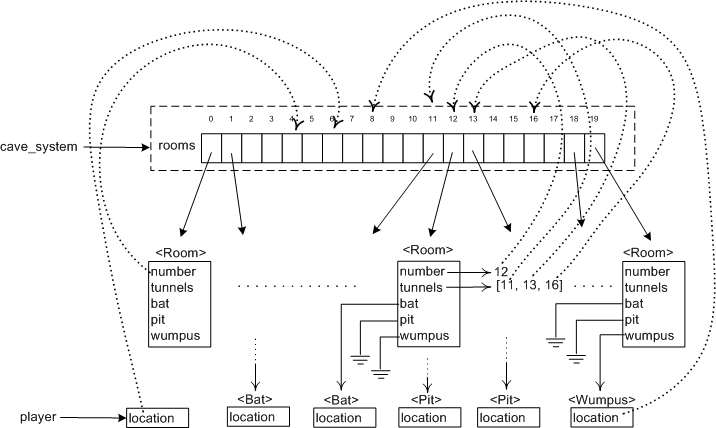

# Memory diagram

To understand the bat snatching bugs you will need to understand how the
program objects are related in memory. Hopefully this diagram will help
in doing that.

Many lines have been left off the diagram to keep it readable, but at
least one connection of each type is shown.

It is important to understand the difference between the solid lines and
the dotted lines. The solid lines represent a standard Python object
reference where a name directly refers to an object. The dotted lines
show where it is possible to make an indirect reference by using a list
index number, i.e. to use the number to access the object by using the
number as an index into the list `cave_system.rooms`. In both cases the
object at the end of the arrow can be referenced, the difference is
whether it requires a subscript to do it or not.

The symbol, ⏚, is used to signify `None`, i.e. that the object reference
is undefined.

One striking feature of the diagram is that only two objects in it have
names, `cave_system` and `player`, and all the others are referenced
through `cave_system`. That is one reason it is forgivable to
have `cave_system` as a global variable: it is effectively the single
point of access for all the objects.
