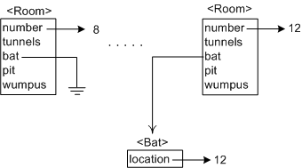
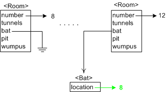
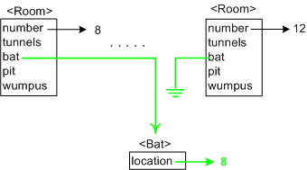
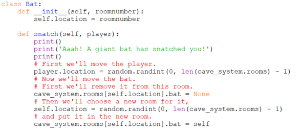

# Bug: Fixing (mostly) snatch

Now keeping the memory diagram open in another window, or perhaps at your side in print form, let's consider the bug identified in the original `Bat.snatch` method. The code is this,

This seems sensible. Remember that `self` is a `Bat`, so the line says to change `self`'s `location` attribute to a random room number. There is nothing wrong with this _as far as it goes_, but more needs to be done. Look at Room 12 in the diagram which contains a `Bat`. Suppose the `Bat`'s new location is Room 8. If we only change the Bat's `location` attribute to be 8, then Room 12 will still think it has a `Bat` in it (see the arrow from Room 12's bat attribute?) and Room 8 won't know it now has a `Bat` in it because we haven't assigned it one. So in addition to changing the `Bat`'s `location` attribute to 8 we need to change Room 12's `bat` attribute to `None`, and Room 8s `bat` attribute to reference this `Bat` object.

In visual terms we are starting with this,

and only ending up with this,

but we need to end up with this,

The new code does that,

## Another Bug

Another smaller less subtle bug remains. When the bat's new room is
chosen it shouldn't be a room with a `Bat` already in it, nor should it
be the room it has just dropped the player in (which will happen
approximately 1 in 20 times since we are choosing randomly). Fixing this
secondary bug will be part of your assignment.
