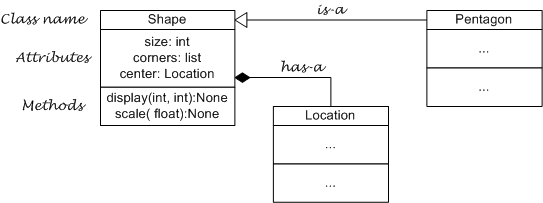

# UML class diagram visual syntax

The visual syntax that UML class diagrams use to show classes'
attributes, methods, and is-a or has-a relationships is fairly
straightforward. Each class is represented by a three part rectangular
box. The top portion is used for the class name. The middle portion
lists the attributes and their types. The bottom portion lists the
methods, the types of arguments they expect, and the type of value they
return.

The relationships between classes are shown using two types of arrows.
One with a traditional arrow head indicate is-a relationships. For
example the diagram below shows that a Pentagon is-a type of Shape.
Arrows with a diamond head indicate has-a relationships. In the diagram
below we can see that a Shape has-a Location attribute named center.

UML class diagrams can have other adornments, in particular they can
show the cardinality of the connections, but we will not be making use
of that feature.

Finally, it is important to notice the difference between a UML class
diagram and a memory diagram, e.g. the one drawn for Hunt the Wumpus in
Module 10.

-   A UML class diagram shows the relation between abstract classes. The
    memory diagram shows the relation between objects, i.e. between
    multiple instantiations of classes.
-   It follows that in a UML diagram you will only ever see one box for
    each class. In a memory diagram you will see as many boxes of each
    class type as there are objects of that type in the running program.
-   The UML diagram shows class methods, whereas most memory diagrams
    just show the object attributes and ignore the methods (because
    while all objects of a given type have the same methods their
    attribute values may differ).
